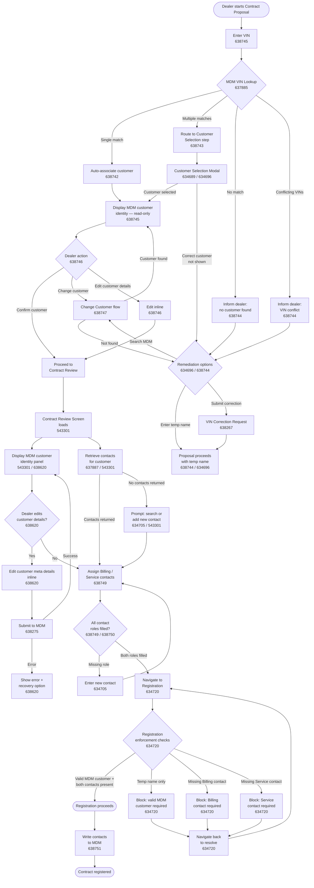
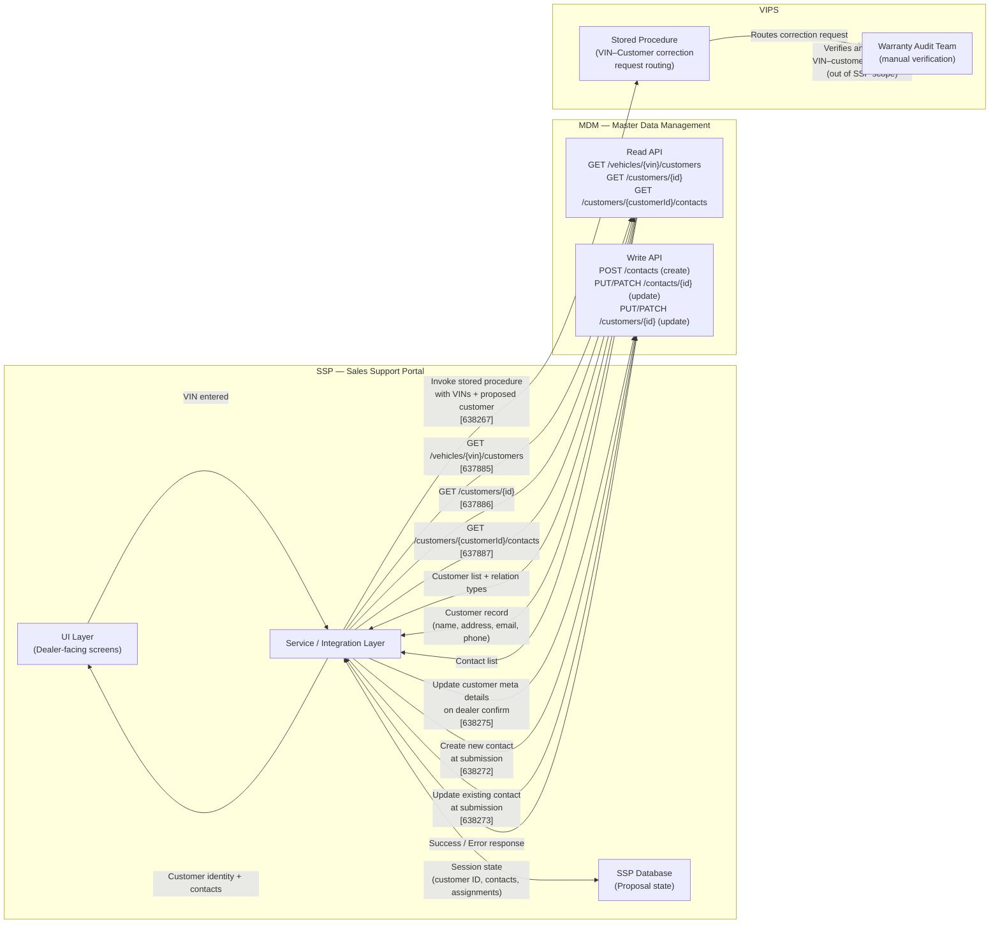
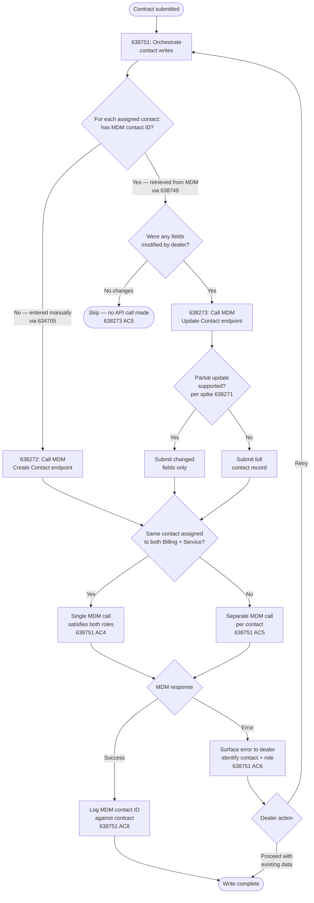

# MDM Integration — Process and Systems Flow Diagrams

**Epic:** MDM Integration (634718)
**Date:** 2026-04-10

---

## 1. Process Flow — Dealer Journey


## 2. Systems Flow — Integration Architecture


## 3. Contact Write Decision Flow — Submission


## 4. VIN Correction Request Flow — Systems

```mermaid
sequenceDiagram
    participant Dealer as Dealer (SSP UI)
    participant SSP as SSP Service Layer
    participant DB as SSP Database
    participant SP as VIPS Stored Procedure
    participant WAT as Warranty Audit Team

    Dealer->>SSP: VIN lookup returns no/wrong customer
    SSP->>Dealer: Present remediation options (638744)
    Dealer->>SSP: Submit VIN correction request (638267)

    SSP->>SP: Invoke stored procedure with:\n· VIN(s)\n· Proposed customer identity\n· Dealer ID\n· Proposal number
    Note over SSP,SP: Stored procedure confirmed via spike 638621

    alt Stored procedure succeeds
        SP-->>SSP: Success response
        SSP->>DB: Log submission (timestamp, VINs,\ncustomer, dealer, proposal, response)
        SSP->>Dealer: Confirm request submitted;\ninform registration remains blocked
        SP->>WAT: Routes correction request
        WAT-->>WAT: Verifies VIN–customer\nrelationship in VIPS\n(out of SSP scope)
    else Stored procedure fails
        SP-->>SSP: Error response
        SSP->>Dealer: Inform submission failed;\noffer retry or direct WAT contact
    end

    Note over Dealer,WAT: Registration stays blocked (634720)\nuntil valid MDM customer is confirmed.\nSSP does not poll for VIPS confirmation.
```

